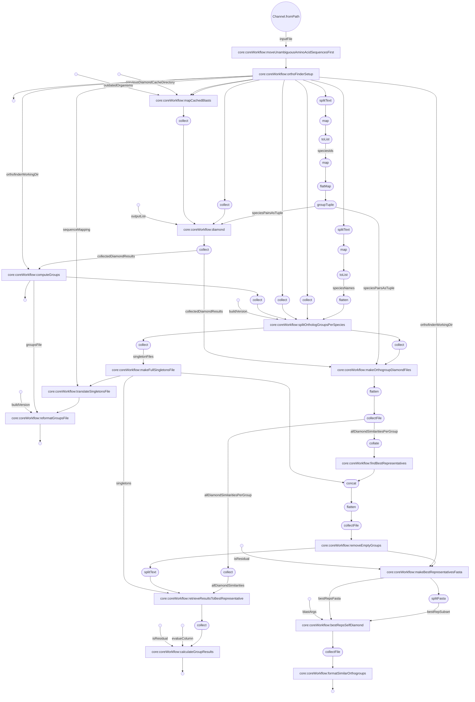
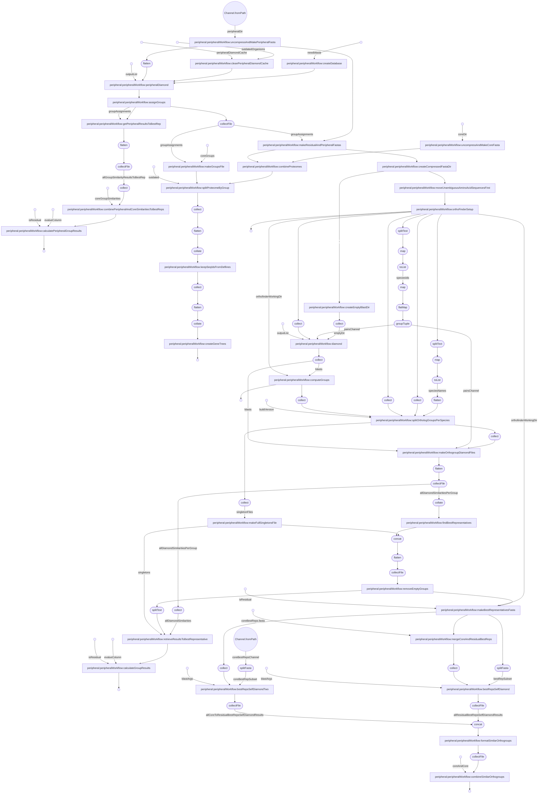

# 
OrthoFinder Nextflow Workflows
   

***
core
***  

  
***
peripheral
***  

**
Explanation of Config File Parameters
**

| core | peripheral | Parameter | Value | Description |
| ---- | ---- | --------- | ----- | ----------- |
| X  | X | outputDir | string path | Where you would like the output files to be stored |
| X  | X | outdatedOrganisms | string path | Path to the file containing outdated organisms abbrevs (generated with checkForUpdate workflow) |
| X | X | buildVersion | string | Build version number |
| X  |   | proteomes | string path | Compressed directory of core organism fasta files |
| X  |   | diamondSimilarityCache | string path | Path to cache directory of diamond similarity results for the core |
| X  |   | orthoFinderDiamondOutput | string | String of outputs passed to diamond job. This should NOT be changed |
| X  |   | bestRepDiamondOutput | string | String of outputs passed to diamond job. This should NOT be changed |
| X |   | coreProteomes | string path | Path to the input directory of core proteomes |
| X |   | coreBestReps | string path | Path to the best representative file produced by the core workflow |
| X |   | peripheralProteomes | string path | Path to peripheral proteomes |
| X |   | coreGroupsFile | string path | Path to groups file output by core workflow |
| X |   | peripheralDiamondCache | string path | Path to peripheral diamond similarity cache of peripheral to core best rep jobs | 
| X |   | coreSimilarityResults | string path | Path to the group similarity results produced by the core workflow |
| X |   | peripheralDiamondOutput | string | String of outputs passed to diamond job. This should NOT be changed |
| X |   | residualDiamondOutput | string | String of outputs passed to diamond job. This should NOT be changed |
| X |   | coreSimilarOrthogroups | string path | Path to core output file indicating the which groups are similar |
