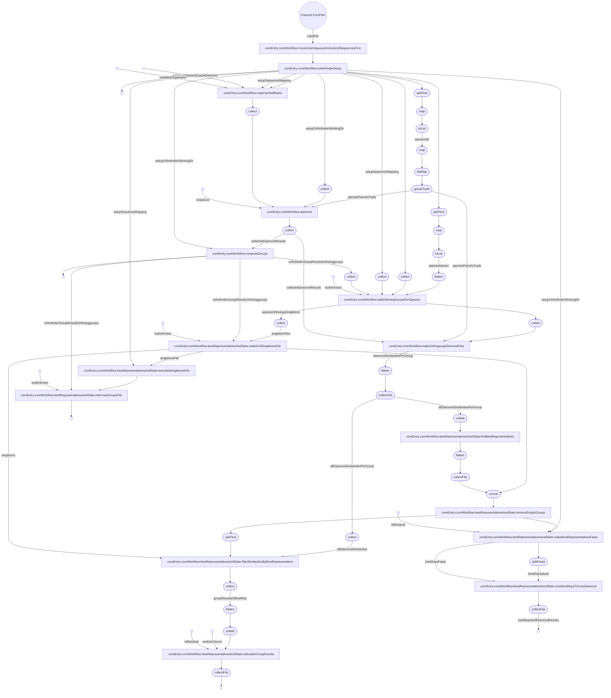
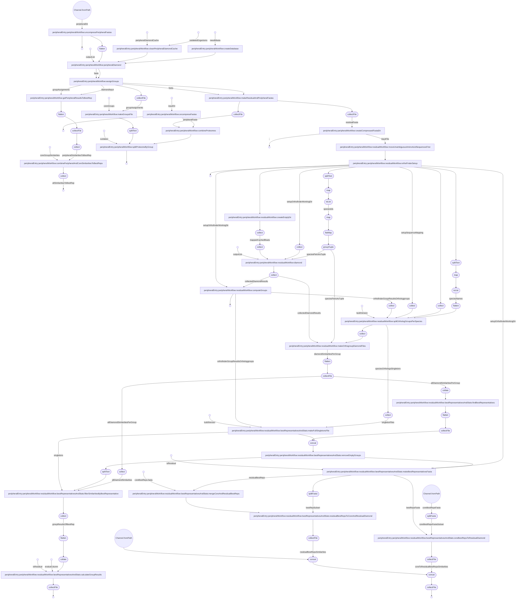

THIS REPO IS 🚧 UNDER CONSTRUCTION 🚧 and NOT Used in ANY production CODE
# <p align=center>OrthoFinder Nextflow Workflows</p>   

***<p align=center>core</p>***  

```mermaid
flowchart TD
    p0((Channel.fromPath))
    p1[coreEntry:coreWorkflow:moveUnambiguousAminoAcidSequencesFirst]
    p2[coreEntry:coreWorkflow:orthoFinderSetup]
    p3(( ))
    p4(( ))
    p5(( ))
    p6[coreEntry:coreWorkflow:mapCachedBlasts]
    p7([splitText])
    p8([map])
    p9([toList])
    p10([splitText])
    p11([map])
    p12([toList])
    p13([map])
    p14([flatMap])
    p15([groupTuple])
    p16([collect])
    p17([collect])
    p18(( ))
    p19[coreEntry:coreWorkflow:diamond]
    p20([collect])
    p21[coreEntry:coreWorkflow:computeGroups]
    p22(( ))
    p23([flatten])
    p24([collect])
    p25([collect])
    p26([collect])
    p27(( ))
    p28[coreEntry:coreWorkflow:splitOrthologGroupsPerSpecies]
    p29([collect])
    p30[coreEntry:coreWorkflow:makeOrthogroupDiamondFiles]
    p31([flatten])
    p32([collectFile])
    p33([collect])
    p34([collect])
    p35(( ))
    p36[coreEntry:coreWorkflow:bestRepresentativesAndStats:makeFullSingletonsFile]
    p37([collate])
    p38[coreEntry:coreWorkflow:bestRepresentativesAndStats:findBestRepresentatives]
    p39([flatten])
    p40([collectFile])
    p41([concat])
    p42[coreEntry:coreWorkflow:bestRepresentativesAndStats:removeEmptyGroups]
    p43(( ))
    p44[coreEntry:coreWorkflow:bestRepresentativesAndStats:makeBestRepresentativesFasta]
    p45([splitText])
    p46[coreEntry:coreWorkflow:bestRepresentativesAndStats:filterSimilaritiesByBestRepresentative]
    p47([collect])
    p48([splitFasta])
    p49([flatten])
    p50([collate])
    p51(( ))
    p52(( ))
    p53[coreEntry:coreWorkflow:bestRepresentativesAndStats:calculateGroupResults]
    p54([collectFile])
    p55(( ))
    p56[coreEntry:coreWorkflow:bestRepresentativesAndStats:coreBestRepsToCoreDiamond]
    p57([collectFile])
    p58(( ))
    p59[coreEntry:coreWorkflow:bestRepresentativesAndStats:translateSingletonsFile]
    p60(( ))
    p61[coreEntry:coreWorkflow:bestRepresentativesAndStats:reformatGroupsFile]
    p62(( ))
    p0 -->|inputFile| p1
    p1 --> p2
    p2 --> p3
    p2 -->|setupOrthofinderWorkingDir| p16
    p2 --> p6
    p2 -->|setupSequenceMapping| p6
    p4 -->|previousDiamondCacheDirectory| p6
    p5 -->|outdatedOrganisms| p6
    p6 --> p17
    p2 --> p7
    p7 --> p8
    p8 --> p9
    p9 -->|speciesIds| p13
    p2 --> p10
    p10 --> p11
    p11 --> p12
    p12 -->|speciesNames| p23
    p13 --> p14
    p14 --> p15
    p15 -->|speciesPairsAsTuple| p19
    p16 --> p19
    p17 --> p19
    p18 -->|outputList| p19
    p19 --> p20
    p20 -->|collectedDiamondResults| p21
    p2 -->|setupOrthofinderWorkingDir| p21
    p21 -->|orthofinderGroupResultsOrthologgroups| p26
    p21 --> p22
    p23 --> p28
    p2 --> p24
    p24 --> p28
    p2 -->|setupSequenceMapping| p25
    p25 --> p28
    p26 --> p28
    p27 -->|buildVersion| p28
    p28 --> p29
    p28 -->|speciesOrthologsSingletons| p34
    p29 --> p30
    p15 -->|speciesPairsAsTuple| p30
    p20 -->|collectedDiamondResults| p30
    p30 -->|diamondSimilaritiesPerGroup| p31
    p31 --> p32
    p32 -->|allDiamondSimilaritiesPerGroup| p33
    p33 -->|allDiamondSimilarities| p46
    p34 -->|singletonFiles| p36
    p21 -->|orthofinderGroupResultsOrthologgroups| p36
    p35 -->|buildVersion| p36
    p36 --> p41
    p32 -->|allDiamondSimilaritiesPerGroup| p37
    p37 --> p38
    p38 --> p39
    p39 --> p40
    p40 --> p41
    p41 --> p42
    p42 --> p44
    p2 -->|setupOrthofinderWorkingDir| p44
    p43 -->|isResidual| p44
    p44 --> p48
    p42 --> p45
    p45 --> p46
    p36 -->|singletons| p46
    p46 --> p47
    p47 -->|groupResultsOfBestRep| p49
    p48 -->|bestRepSubset| p56
    p49 --> p50
    p50 --> p53
    p51 -->|evalueColumn| p53
    p52 -->|isResidual| p53
    p53 --> p54
    p54 --> p55
    p44 -->|bestRepsFasta| p56
    p56 --> p57
    p57 -->|bestRepsSelfDiamondResults| p58
    p36 -->|singletonsFile| p59
    p2 -->|setupSequenceMapping| p59
    p59 --> p61
    p21 -->|orthofinderGroupResultsOrthologgroups| p61
    p60 -->|buildVersion| p61
    p61 --> p62
```
  
***<p align=center>peripheral</p>***  


```mermaid
flowchart TD
    p0((Channel.fromPath))
    p1[peripheralEntry:peripheralWorkflow:uncompressPeripheralFastas]
    p2(( ))
    p3(( ))
    p4[peripheralEntry:peripheralWorkflow:uncompressFastas]
    p5(( ))
    p6(( ))
    p7[peripheralEntry:peripheralWorkflow:createDatabase]
    p8(( ))
    p9(( ))
    p10[peripheralEntry:peripheralWorkflow:cleanPeripheralDiamondCache]
    p11([flatten])
    p12(( ))
    p13[peripheralEntry:peripheralWorkflow:peripheralDiamond]
    p14[peripheralEntry:peripheralWorkflow:assignGroups]
    p15[peripheralEntry:peripheralWorkflow:makeResidualAndPeripheralFastas]
    p16([collectFile])
    p17([collectFile])
    p18([collectFile])
    p19[peripheralEntry:peripheralWorkflow:getPeripheralResultsToBestRep]
    p20([flatten])
    p21([collectFile])
    p22([collect])
    p23(( ))
    p24[peripheralEntry:peripheralWorkflow:combinePeripheralAndCoreSimilaritiesToBestReps]
    p25([collect])
    p26(( ))
    p27[peripheralEntry:peripheralWorkflow:combineProteomes]
    p28(( ))
    p29[peripheralEntry:peripheralWorkflow:makeGroupsFile]
    p30([splitText])
    p31(( ))
    p32[peripheralEntry:peripheralWorkflow:splitProteomeByGroup]
    p33(( ))
    p34[peripheralEntry:peripheralWorkflow:createCompressedFastaDir]
    p35(( ))
    p36[peripheralEntry:peripheralWorkflow:residualWorkflow:moveUnambiguousAminoAcidSequencesFirst]
    p37[peripheralEntry:peripheralWorkflow:residualWorkflow:orthoFinderSetup]
    p38(( ))
    p39[peripheralEntry:peripheralWorkflow:residualWorkflow:createEmptyDir]
    p40([collect])
    p41([splitText])
    p42([map])
    p43([toList])
    p44([splitText])
    p45([map])
    p46([toList])
    p47([map])
    p48([flatMap])
    p49([groupTuple])
    p50([collect])
    p51([collect])
    p52(( ))
    p53[peripheralEntry:peripheralWorkflow:residualWorkflow:diamond]
    p54([collect])
    p55[peripheralEntry:peripheralWorkflow:residualWorkflow:computeGroups]
    p56(( ))
    p57([flatten])
    p58([collect])
    p59([collect])
    p60([collect])
    p61(( ))
    p62[peripheralEntry:peripheralWorkflow:residualWorkflow:splitOrthologGroupsPerSpecies]
    p63([collect])
    p64[peripheralEntry:peripheralWorkflow:residualWorkflow:makeOrthogroupDiamondFiles]
    p65([flatten])
    p66([collectFile])
    p67([collect])
    p68([collect])
    p69(( ))
    p70[peripheralEntry:peripheralWorkflow:residualWorkflow:bestRepresentativesAndStats:makeFullSingletonsFile]
    p71([collate])
    p72[peripheralEntry:peripheralWorkflow:residualWorkflow:bestRepresentativesAndStats:findBestRepresentatives]
    p73([flatten])
    p74([collectFile])
    p75([concat])
    p76[peripheralEntry:peripheralWorkflow:residualWorkflow:bestRepresentativesAndStats:removeEmptyGroups]
    p77(( ))
    p78[peripheralEntry:peripheralWorkflow:residualWorkflow:bestRepresentativesAndStats:makeBestRepresentativesFasta]
    p79([splitText])
    p80[peripheralEntry:peripheralWorkflow:residualWorkflow:bestRepresentativesAndStats:filterSimilaritiesByBestRepresentative]
    p81([collect])
    p82([splitFasta])
    p83([flatten])
    p84([collate])
    p85(( ))
    p86(( ))
    p87[peripheralEntry:peripheralWorkflow:residualWorkflow:bestRepresentativesAndStats:calculateGroupResults]
    p88([collectFile])
    p89(( ))
    p90(( ))
    p91[peripheralEntry:peripheralWorkflow:residualWorkflow:bestRepresentativesAndStats:mergeCoreAndResidualBestReps]
    p92[peripheralEntry:peripheralWorkflow:residualWorkflow:bestRepresentativesAndStats:residualBestRepsToCoreAndResidualDiamond]
    p93([collectFile])
    p94((Channel.fromPath))
    p95([splitFasta])
    p96[peripheralEntry:peripheralWorkflow:residualWorkflow:bestRepresentativesAndStats:coreBestRepsToResidualDiamond]
    p97([collectFile])
    p98((Channel.fromPath))
    p99([concat])
    p100([concat])
    p101([collectFile])
    p102(( ))
    p0 -->|peripheralDir| p1
    p1 --> p11
    p1 --> p2
    p3 -->|inputDir| p4
    p4 --> p5
    p4 --> p27
    p6 -->|newdbfasta| p7
    p7 --> p13
    p8 -->|outdatedOrganisms| p10
    p9 -->|peripheralDiamondCache| p10
    p10 --> p13
    p11 --> p13
    p12 -->|outputList| p13
    p13 --> p14
    p13 -->|fasta| p14
    p14 --> p15
    p14 -->|diamondInput| p19
    p14 -->|fasta| p15
    p15 --> p16
    p15 --> p17
    p16 -->|residualFasta| p34
    p17 -->|peripheralFasta| p27
    p14 --> p18
    p18 -->|groupAssignments| p29
    p14 -->|groupAssignments| p19
    p19 --> p20
    p20 --> p21
    p21 --> p22
    p22 -->|peripheralSimilaritiesToBestRep| p24
    p23 -->|coreGroupSimilarities| p24
    p24 --> p25
    p25 -->|allSimilaritiesToBestRep| p26
    p27 --> p32
    p28 -->|coreGroups| p29
    p29 --> p30
    p30 --> p32
    p31 -->|outdated| p32
    p32 --> p33
    p34 -->|inputFile| p36
    p34 -->|-| p35
    p36 --> p37
    p37 --> p38
    p37 -->|setupOrthofinderWorkingDir| p50
    p37 --> p39
    p37 -->|setupSequenceMapping| p59
    p39 --> p40
    p40 -->|mappedCachedBlasts| p51
    p37 --> p41
    p41 --> p42
    p42 --> p43
    p43 -->|speciesIds| p47
    p37 --> p44
    p44 --> p45
    p45 --> p46
    p46 -->|speciesNames| p57
    p47 --> p48
    p48 --> p49
    p49 -->|speciesPairsAsTuple| p53
    p50 --> p53
    p51 --> p53
    p52 -->|outputList| p53
    p53 --> p54
    p54 -->|collectedDiamondResults| p55
    p37 -->|setupOrthofinderWorkingDir| p55
    p55 -->|orthofinderGroupResultsOrthologgroups| p60
    p55 --> p56
    p57 --> p62
    p37 --> p58
    p58 --> p62
    p59 --> p62
    p60 --> p62
    p61 -->|buildVersion| p62
    p62 --> p63
    p62 -->|speciesOrthologsSingletons| p68
    p63 --> p64
    p49 -->|speciesPairsAsTuple| p64
    p54 -->|collectedDiamondResults| p64
    p64 -->|diamondSimilaritiesPerGroup| p65
    p65 --> p66
    p66 -->|allDiamondSimilaritiesPerGroup| p67
    p67 -->|allDiamondSimilarities| p80
    p68 -->|singletonFiles| p70
    p55 -->|orthofinderGroupResultsOrthologgroups| p70
    p69 -->|buildVersion| p70
    p70 --> p75
    p66 -->|allDiamondSimilaritiesPerGroup| p71
    p71 --> p72
    p72 --> p73
    p73 --> p74
    p74 --> p75
    p75 --> p76
    p76 --> p78
    p37 -->|setupOrthofinderWorkingDir| p78
    p77 -->|isResidual| p78
    p78 --> p82
    p76 --> p79
    p79 --> p80
    p70 -->|singletons| p80
    p80 --> p81
    p81 -->|groupResultsOfBestRep| p83
    p82 -->|bestRepSubset| p92
    p83 --> p84
    p84 --> p87
    p85 -->|evalueColumn| p87
    p86 -->|isResidual| p87
    p87 --> p88
    p88 --> p89
    p78 -->|residualBestReps| p91
    p90 -->|coreBestReps.fasta| p91
    p91 --> p92
    p92 --> p93
    p93 -->|residualBestRepsSimilarities| p99
    p94 -->|coreBestRepsFasta| p95
    p95 -->|coreBestRepsFastaSubset| p96
    p78 -->|bestRepsFasta| p96
    p96 --> p97
    p97 -->|coreToResidualBestRepsSimilarities| p100
    p98 --> p99
    p99 --> p100
    p100 --> p101
    p101 --> p102
```

---

## Workflow Synopsis

### Overview

This is a multi-stage Nextflow pipeline for protein ortholog group inference, built around the OrthoFinder MCL clustering algorithm. It is designed to handle large-scale comparative genomics data by splitting proteomes into "core" (high-confidence) and "peripheral" (lower-quality/partial) sets, clustering them progressively, and supporting incremental updates without reprocessing unchanged data.

---

### Phase 1: Full Discovery Pipeline

The full pipeline runs in five stages:

**1. Core** (`modules/core.nf`)
The foundation of the entire workflow. Core proteomes — the highest-quality reference organisms — are processed through DIAMOND all-vs-all pairwise similarity searches, then clustered into ortholog groups by OrthoFinder's MCL algorithm. Per-group DIAMOND similarity files and a best-representative FASTA are produced for downstream use. A DIAMOND similarity cache is maintained so that unchanged organisms don't need to be re-searched in future runs. Singletons (proteins with no homologs) are assigned unique group IDs.

**2. Peripheral** (`modules/peripheral.nf`)
Peripheral proteomes are BLASTed against the core best-representative sequences. Each peripheral protein is assigned to the core group whose representative has the lowest e-value hit. Proteins that don't meet assignment thresholds are partitioned off as **residuals**. The result is an expanded groups file combining all core and peripheral sequences, plus per-group FASTAs and updated similarity files that include peripheral-to-core scores.

**3. Residual** (`modules/residual.nf`)
The residual sequences — those peripheral proteins that could not be assigned to any core group — are clustered independently using the same OrthoFinder MCL pipeline used in core. This catches distant homology relationships that couldn't be anchored to an existing group.

**4. Post-Residual** (`modules/postResidual.nf`)
Residual groups are reformatted with a distinguishing "R" prefix (e.g., `OGR7r1_*`) and processed to identify best representatives and compute group statistics. Per-group FASTAs and a best-reps FASTA are published.

**5. Post-Processing** (`modules/postProcessing.nf`)
The final merge stage. Core+peripheral and residual outputs are unified into a single groups file, proteome FASTA, and DIAMOND database with group IDs embedded in sequence deflines. A self-DIAMOND search across all best representatives identifies similar groups. Groups are filtered by size (3 ≤ n < 1000 sequences) for downstream tree inference.

---

### Phase 2: Incremental Update Pipeline

When the **core sequences have not changed**, the expensive core clustering step can be skipped entirely. Only new peripheral organisms need to be processed, using three update-specific modules:

**6. Update-Peripheral** (`modules/updatePeripheral.nf`)
New peripheral proteomes are run through the same DIAMOND-vs-core + group-assignment logic as the original peripheral workflow. New sequences are appended to the existing core+peripheral groups file rather than re-clustering from scratch. Sequences that don't assign to any core group become **new residuals**, packaged for the next stage. Best representatives are not recomputed — existing representatives are reused and statistics are recalculated on top of them, conserving compute.

**7. Update-Residual** (`modules/updateResidual.nf`)
New residuals from the update-peripheral stage are clustered with OrthoFinder into new residual groups, assigned a new sub-version ID (e.g., `OGR7r2_*`). These new groups are then **appended** to the existing residual groups file rather than replacing it. Existing residual groups (`OGR7r1_*`) are fully preserved — only genuinely new residual proteins are processed through the expensive clustering step.

**8. Post-Update** (`modules/postUpdate.nf`)
Mirrors post-processing for the update cycle. Existing and new residual best-rep FASTAs are merged, all proteomes and group files are unified, and final outputs (full groups file, full proteome, DIAMOND database) are produced with the same structure as the full pipeline's post-processing stage.

---

### Data Flow

```
Full Pipeline:
  Core Proteomes
      |
  [core] ──────────────────────────────────> reformattedGroups.txt
      |                                       groupDiamondResults/
  Peripheral Proteomes                        diamondCache/
      |
  [peripheral] ────────────────────────────> GroupsFile.txt (core+peripheral)
      |                                       groupFastas/
  residualFastas.tar.gz                       coreBestReps.fasta
      |
  [residual] ──────────────────────────────> Orthogroups.txt
      |
  [postResidual] ──────────────────────────> reformattedGroups.txt (OGR7r1_*)
      |                                       bestReps.fasta
  [postProcessing] ────────────────────────> fullGroupFile.txt
                                              fullProteome.fasta
                                              ortho{version}db.dmnd

Update Pipeline (core unchanged):
  New Peripheral Proteomes
      |
  [updatePeripheral] ──────────────────────> GroupsFile.txt (appended)
      |                                       groupFastas/ (updated)
  residualFastas.tar.gz (new residuals only)
      |
  [updateResidual] ────────────────────────> updatedResidualGroups.txt
      |                                         (OGR7r1_* preserved + OGR7r2_* new)
  [postUpdate] ────────────────────────────> fullGroupFile.txt
                                              fullProteome.fasta
                                              ortho{version}db.dmnd
```

---

### Key Design Principles

- **Caching at every boundary**: DIAMOND results are cached by organism pair; the cache is invalidated selectively for updated organisms, preserving all other results.
- **Append, don't rebuild**: Both update workflows append to existing outputs rather than re-clustering, making incremental updates proportional to new data rather than total data size.
- **Shared process library**: `modules/shared.nf` provides reusable processes (DIAMOND, OrthoFinder setup, FASTA splitting, best-rep selection) imported by multiple workflows.
- **Version-tagged group IDs**: Groups carry a build version in their ID (e.g., `OG7_*`, `OGR7r1_*`, `OGR7r2_*`), enabling tracking of which build introduced each group.

---

**<p align=center>Explanation of Config File Parameters</p>**

| core | peripheral | Parameter | Value | Description |
| ---- | ---- | --------- | ----- | ----------- |
| X | X | outputDir | string path | Where you would like the output files to be stored |
| X | X | outdatedOrganisms | string path | Path to the file containing outdated organisms abbrevs (generated with checkForUpdate workflow) |
| X | X | buildVersion | string | Build version number |
| X |   | orthoFinderDiamondOutputFields | string | String of outputs passed to diamond job. This should NOT be changed |
| X |   | bestRepDiamondOutputFields | string | String of outputs passed to diamond job. This should NOT be changed |
| X |   | proteomes | string path | Compressed directory of core organism fasta files |
| X |   | diamondSimilarityCache | string path | Path to cache directory of diamond similarity results for the core |
|   | X | coreProteomes | string path | Path to the input directory of core proteomes |
|   | X | coreBestReps | string path | Path to the best representative file produced by the core workflow |
|   | X | peripheralProteomes | string path | Path to peripheral proteomes |
|   | X | coreGroupsFile | string path | Path to groups file output by core workflow |
|   | X | peripheralDiamondCache | string path | Path to peripheral diamond similarity cache of peripheral to core best rep jobs | 
|   | X | coreSimilarityToBestReps | string path | Path to the group similarity results produced by the core workflow |
|   | X | coreBestRepsSelfBlast | string path | Path to core output file indicating the which groups are similar |
